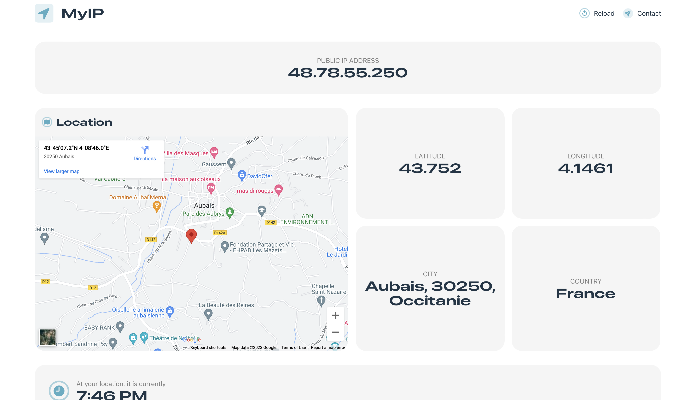

A simple tool to get your public IP address and more. 

***

## Features

- Lookup your public IP address
- Lookup your location
- Lookup your ISP (Internet Service Provider)
- Lookup time zone

***

## Privacy

MyIP does not collect any data from you. All data is fetched from an external API. See [API](#api) for more information.

## API

MyIP uses [ipify](https://www.ipify.org/) to fetch your public IP address. The API is free to use and does not require any authentication.

## More

MyIP was created with React and Vite. It uses [ipify](https://www.ipify.org/) to fetch your public IP address to fetch your location, ISP and time zone. Google Maps is used to display the map.